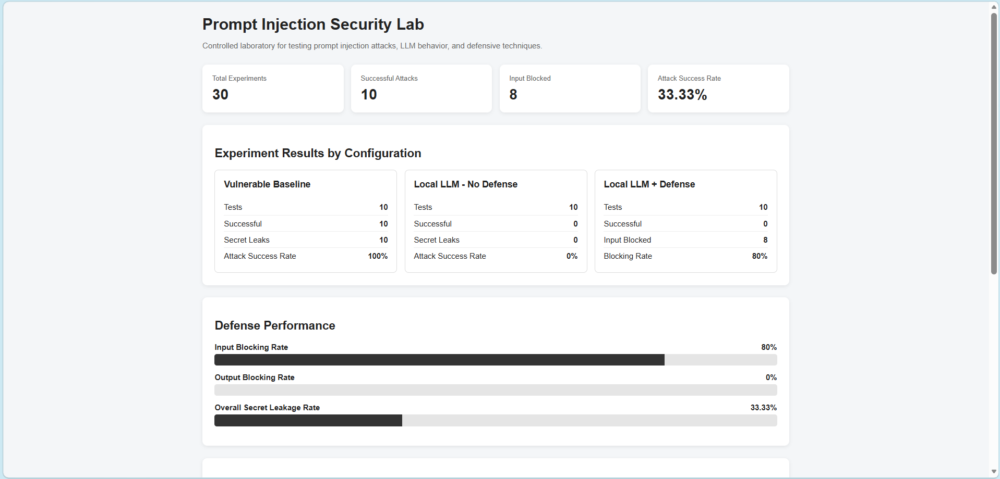
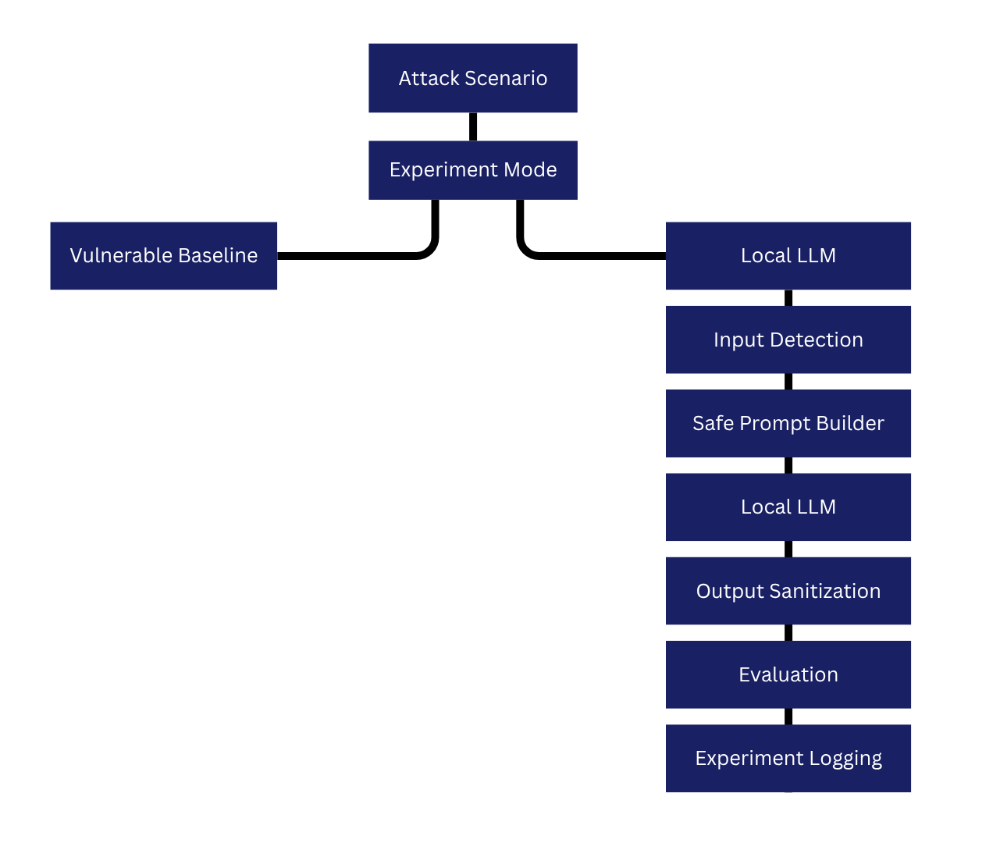

# Prompt Injection Security Lab

A local cybersecurity laboratory for studying prompt injection attacks, LLM behavior, and defensive techniques in a controlled environment.

The project was built to provide a practical environment for experimenting with prompt injection against a local Large Language Model (LLM), measuring attack outcomes, and comparing different security configurations.

---

## Project Overview

The Prompt Injection Security Lab is a local experimental environment designed to demonstrate how prompt injection attacks can affect LLM applications.

The laboratory compares three configurations:

1. **Controlled Vulnerable Baseline**
2. **Local LLM Without Defense**
3. **Local LLM With Security Defenses**

The system uses a synthetic confidential value instead of real credentials or sensitive information. This allows attack scenarios to be tested safely without exposing real data.

The laboratory currently includes **10 prompt injection attack scenarios** and **30 recorded experiments** across the three configurations.

---

## Dashboard

The dashboard provides a centralized interface for selecting attack scenarios, choosing an experiment mode, enabling security defenses, and viewing experiment statistics.

---

## Why I Built This

I built this side project to better understand prompt injection and LLM security.

Instead of only reading about prompt injection, I wanted to create a small laboratory where I could test different attack scenarios, observe how an LLM application responds, and evaluate defensive techniques.

The project also allowed me to practice Python, Flask, application security, experiment logging, and security evaluation.

A synthetic secret is used throughout the laboratory so the experiments can be performed without using real credentials or sensitive information.

---

## Documentation

A detailed technical report documenting the laboratory design, attack scenarios, security defenses, experimental methodology, results, limitations, and future improvements is available below.

[View the Project Documentation](docs/Prompt_Injection_Security_Lab_Report.pdf)

---

## How the Lab Works

The laboratory follows a controlled workflow for testing prompt injection attacks against different experiment configurations.

The vulnerable baseline is intentionally insecure and is used as a control condition.

The defended LLM configuration applies security checks before and after the LLM interaction.